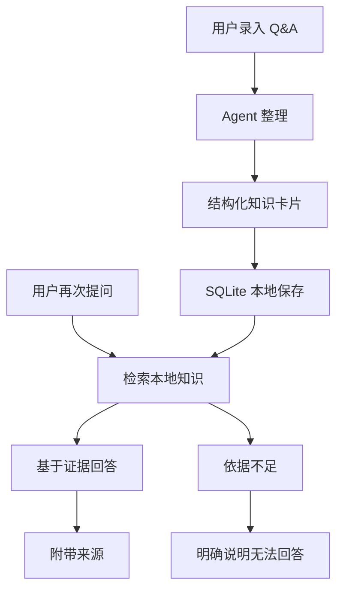

# Personal Knowledge Agent Harness

这是一个本地个人 Q&A 知识库 Agent。第一版只验证 Q&A 场景，不做 Wiki、不做文件监听、不做周报、不做多 Agent。

项目目标不是实现一个普通问答机器人，而是验证一个最小知识资产闭环：

1. 用户录入 Q&A
2. Agent 整理成结构化知识卡片
3. 保存到本地 SQLite 数据库
4. 用户再次提问
5. Agent 检索本地知识
6. 基于检索结果回答
7. 回答附带来源

## 核心原则

- 模型负责判断和表达
- 工具负责执行动作
- SQLite 负责长期记忆
- 回答必须可追溯
- 找不到依据不编造

## 第一版范围

### 做

- 录入用户提供的 Q&A
- 将 Q&A 整理为结构化知识卡片
- 将知识卡片持久化到本地 SQLite
- 根据用户问题检索本地知识
- 基于检索结果生成回答
- 在回答中附带来源信息
- 在依据不足时明确说明无法回答

### 不做

- 不做通用聊天机器人
- 不做 Wiki 页面系统
- 不做文件夹监听或自动索引
- 不做周报、日报或自动总结
- 不做多 Agent 协作
- 不做云端同步
- 不把模型输出当作长期记忆直接保存

## 最小知识资产闭环



## 知识卡片建议结构

第一版可以从简，优先保证可追溯和可检索：

```text
id: 本地唯一标识
question: 原始问题
answer: 原始答案
summary: Agent 整理后的简明结论
keywords: 关键词
source_type: 来源类型，例如 manual_qa
source_ref: 来源引用，例如录入时间或会话标识
created_at: 创建时间
updated_at: 更新时间
```

后续如有需要，再增加标签、置信度、版本、关联卡片等字段。

## 回答约束

Agent 回答问题时必须遵守：

- 优先检索本地 SQLite 中的知识卡片
- 只基于检索到的相关知识回答
- 回答中附带来源，例如知识卡片 ID、原始问题、录入时间
- 如果没有足够依据，直接说明“本地知识库中没有找到足够依据”
- 可以给出下一步建议，例如建议用户补充一条 Q&A

## 项目状态

当前处于初始化阶段。第一阶段重点是定义数据结构、工具接口和 Q&A 闭环，不急于扩展复杂能力。

## 文档结构

```text
AGENTS.md
README.md
docs/guidelines/collaboration-preferences.md
docs/guidelines/ai-coding-behavior.md
docs/templates/agent-development-context.template.md
docs/agents/
scripts/check-agent-doc-format.py
```

- `AGENTS.md`: 仓库级 AI Coding 入口、项目约束和本地规约索引。
- `README.md`: 项目定位、第一版范围和最小知识资产闭环。
- `docs/guidelines/collaboration-preferences.md`: 用户协作偏好。
- `docs/guidelines/ai-coding-behavior.md`: AI Coding 行为规约。
- `docs/templates/agent-development-context.template.md`: Agent 开发上下文模板。
- `docs/agents/`: 具体 Agent 的开发上下文文档目录。
- `scripts/check-agent-doc-format.py`: Agent 开发上下文模板与具体 Agent 文档格式检查脚本。
