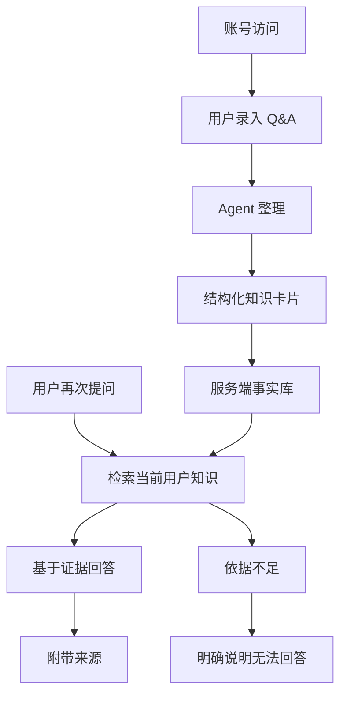

# Personal Knowledge Agent Harness

这是一个云端个人 Q&A 知识库 Agent Harness。项目目标是把用户提供的零散 Q&A 整理为可检索、可追溯、可复用、按用户隔离的知识资产，并通过 Web 入口提供持续对话和知识检索能力。

当前云端化阶段的稳定设计边界以 [`docs/agents/cloud-qa-knowledge-agent.md`](docs/agents/cloud-qa-knowledge-agent.md) 为准。代码仍保留从本地 Q&A Agent 演进而来的模块结构，云端化实现需要按文档边界逐步迁移。

## 核心原则

- 模型负责判断和表达。
- 工具负责执行动作。
- 服务端数据库负责长期事实。
- Q&A、todo、session 和用户偏好记忆必须按用户隔离。
- 回答必须可追溯。
- 找不到依据不编造。
- 账号、验证码、登录态和用户准入不由 Agent loop 承担。

## 云端化方向

目标闭环：

1. 用户通过账号访问 Web 服务。
2. 用户录入 Q&A。
3. Agent 整理成结构化知识卡片。
4. 工具把知识卡片保存到服务端事实库。
5. 用户再次提问。
6. Agent 检索当前用户的知识。
7. Agent 基于检索结果回答。
8. 回答附带来源。



## 当前边界

云端化后的目标边界：

- 使用邮箱验证码登录。
- 当前只允许 `1033795760@qq.com` 使用。
- 不做密码登录，不做 magic link。
- 使用 PostgreSQL 作为事实库，使用 pgvector 作为 Q&A 语义召回索引。
- Q&A、todo、session 和 user-preference memory 必须用户隔离。
- Tool schema 不暴露 `user_id`。
- DeepSeek 调用只使用非隐私 `llm_provider_user_id`。
- 旧 SQLite 数据只迁移 Q&A，不迁移旧 session、Qdrant、todo 或本地 memory。

当前不纳入本阶段：

- Redis。
- KMS。
- 多副本运行。
- 管理后台。
- 复杂迁移框架。
- Markdown Wiki、文件监听、周报、日报或多 Agent。

## 代码状态

当前代码已具备本地 Q&A Agent 的基础能力，包括：

- Q&A 保存、读取、更新、删除、最近列表和检索。
- hybrid 检索和 category。
- todo 保存、查询和更新。
- session 恢复、上下文压缩和 memory candidate 事件。
- 本地 Web Chat + Cards 基础入口。

这些能力是云端化改造的迁移基础，不代表所有云端账号化、用户隔离和生产部署边界已经完成。

## 本地运行

本地开发仍可使用现有 CLI / Web 入口调试当前代码：

```bash
uv venv
uv pip install -e .
. .venv/bin/activate
```

CLI：

```bash
python -m personal_knowledge_agent
```

Web：

```bash
python -m personal_knowledge_agent.web
```

本地运行配置、密钥和数据目录不得提交到 Git。生产环境 secrets 不应通过明文 `.env` 保存。

## 文档结构

```text
AGENTS.md
README.md
docs/guidelines/collaboration-preferences.md
docs/guidelines/ai-coding-behavior.md
docs/templates/agent-development-context.template.md
docs/agents/cloud-qa-knowledge-agent.md
docs/architecture/codebase-map.md
scripts/check-agent-doc-format.py
```

- `AGENTS.md`: AI Coding 工作入口，负责协作规约加载和开发文档路由。
- `README.md`: 项目方向、当前边界和本地运行概览。
- `docs/guidelines/collaboration-preferences.md`: 任务计划、执行确认、分支和提交协作规则。
- `docs/guidelines/ai-coding-behavior.md`: 调研、编码和验证行为规则。
- `docs/templates/agent-development-context.template.md`: Agent 边界文档结构模板，不保存任务计划。
- `docs/agents/cloud-qa-knowledge-agent.md`: 云端个人 Q&A 知识库 Agent 的稳定设计边界。
- `docs/architecture/codebase-map.md`: 当前代码目录和文件职责地图。
- `scripts/check-agent-doc-format.py`: Agent 开发上下文模板与具体 Agent 文档格式检查脚本。
