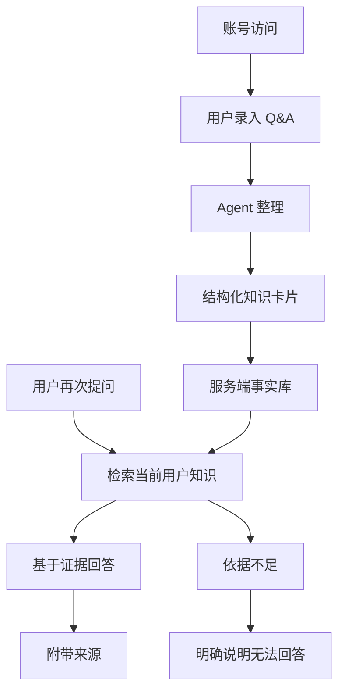

# Personal Knowledge Agent Harness

这是一个云端个人 Q&A 知识库 Agent Harness。项目目标是把用户提供的零散 Q&A 整理为可检索、可追溯、可复用、按用户隔离的知识资产，并通过 Web 入口提供持续对话和知识检索能力。

当前稳定 runtime 是 cloud-only Web 服务，稳定设计边界以 [`docs/agents/cloud-qa-knowledge-agent.md`](docs/agents/cloud-qa-knowledge-agent.md) 为准。业务数据读写必须经过认证用户上下文，并以 PostgreSQL / pgvector 作为运行时事实库和语义召回索引。

## 核心原则

- 模型负责判断和表达。
- 工具负责执行动作。
- 服务端数据库负责长期事实。
- Q&A、todo、session 和用户偏好记忆必须按用户隔离。
- 回答必须可追溯。
- 找不到依据不编造。
- 账号、验证码、登录态和用户准入不由 Agent loop 承担。

## Cloud-Only Runtime

运行时闭环：

1. 用户通过账号访问 Web 服务。
2. 用户录入 Q&A。
3. Agent 整理成结构化知识卡片。
4. 工具在认证用户上下文中把知识卡片保存到 PostgreSQL。
5. 用户再次提问。
6. Agent 通过 PostgreSQL / pgvector 检索当前用户的知识。
7. Agent 基于检索结果回答。
8. 回答附带来源。



## 当前边界

当前 runtime 边界：

- 使用邮箱验证码登录。
- 当前只允许 `1033795760@qq.com` 使用。
- 不做密码登录，不做 magic link。
- 使用 PostgreSQL 作为事实库，使用 pgvector 作为 Q&A 语义召回索引。
- Q&A、todo、session 和 user-preference memory 必须用户隔离。
- Tool schema 不暴露 `user_id`。
- DeepSeek 调用只使用非隐私 `llm_provider_user_id`。
- 旧 SQLite 仅作为 Q&A 一次性迁移来源，不是 runtime fallback。
- 不迁移旧 session、Qdrant、todo 或本地 memory。

当前不纳入本阶段：

- Redis。
- KMS。
- 多副本运行。
- 管理后台。
- 复杂迁移框架。
- Markdown Wiki、文件监听、周报、日报或多 Agent。

## 代码状态

当前代码包含云端 Web runtime、PostgreSQL / pgvector 基础设施和从本地 Q&A Agent 演进而来的遗留模块。稳定 runtime 只承认以下云端职责：

- 认证用户上下文由 Web / Auth / Service 层解析和注入。
- Q&A、todo、session 和 user-preference memory 的业务读写进入 PostgreSQL。
- Q&A 语义召回使用 pgvector。
- SQLite 只用于 Q&A 一次性迁移输入。

旧 CLI、本地 Web、SQLite / Qdrant、`.sessions/` 和 `.memory/` 文件型实现不再承担 runtime 职责，也不是 PostgreSQL / pgvector 不可用时的降级路径。

## 运行入口

运行入口是已认证的 Web 服务。部署和服务器配置以 `deploy/` 为准；生产 secrets 必须由部署环境或受控 secret 机制注入，不使用生产明文 `.env`。

## 前端原型

前端原型位于 `docs/frontend-prototype/`，用于在修改真实 Web UI 前预览布局、交互状态和 mock 使用流程。

启动方式：

```bash
python3 -m http.server 4173
```

打开：

```text
http://localhost:4173/docs/frontend-prototype/index.html
```

默认流程支持发送验证码、输入 6 位验证码登录、发送普通问题、触发保存审批、批准后刷新知识卡片。调试场景仍可通过 `?controls=1&scenario=chatWithSources` 打开。

原型复用真实静态前端文件，但 `/api/*` 请求由 `docs/frontend-prototype/prototype.js` mock，不连接真实后端。

## 文档结构

```text
AGENTS.md
README.md
docs/guidelines/collaboration-preferences.md
docs/guidelines/ai-coding-behavior.md
docs/templates/agent-development-context.template.md
docs/agents/cloud-qa-knowledge-agent.md
docs/architecture/codebase-map.md
docs/frontend-prototype/
scripts/check-agent-doc-format.py
```

- `AGENTS.md`: AI Coding 工作入口，负责协作规约加载和开发文档路由。
- `README.md`: 项目方向、cloud-only runtime 边界和文档入口概览。
- `docs/guidelines/collaboration-preferences.md`: 任务计划、执行确认、分支和提交协作规则。
- `docs/guidelines/ai-coding-behavior.md`: 调研、编码和验证行为规则。
- `docs/templates/agent-development-context.template.md`: Agent 边界文档结构模板，不保存任务计划。
- `docs/agents/cloud-qa-knowledge-agent.md`: 云端个人 Q&A 知识库 Agent 的稳定设计边界。
- `docs/architecture/codebase-map.md`: 当前代码目录和文件职责地图。
- `docs/frontend-prototype/`: 前端原型静态资产和 mock API，用于预览 Web UI 布局、状态和交互流程。
- `scripts/check-agent-doc-format.py`: Agent 开发上下文模板与具体 Agent 文档格式检查脚本。
