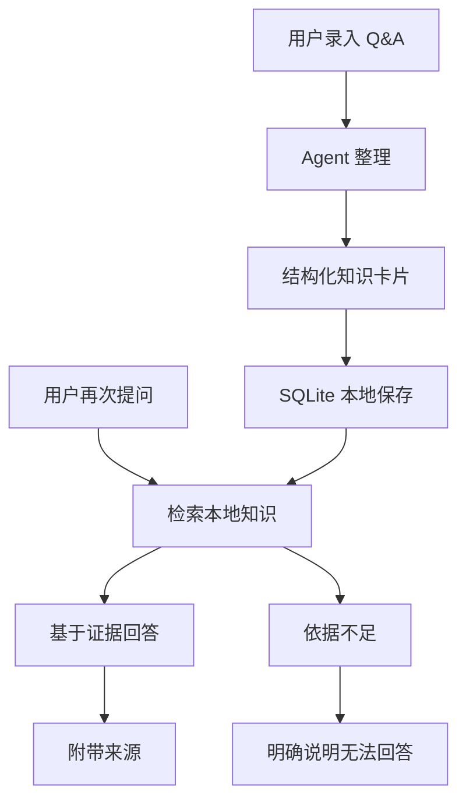

# Personal Knowledge Agent Harness

这是一个本地个人 Q&A 知识库 Agent。第一版只验证 Q&A 场景，不做 Wiki、不做文件监听、不做周报、不做多 Agent。

项目目标不是实现一个普通问答机器人，而是验证一个最小知识资产闭环：

1. 用户录入 Q&A
2. Agent 整理成结构化知识卡片
3. 保存到本地 SQLite 数据库
4. 用户再次提问
5. Agent 检索本地知识
6. 基于检索结果回答
7. 回答附带来源

## 核心原则

- 模型负责判断和表达
- 工具负责执行动作
- SQLite 负责长期记忆
- 回答必须可追溯
- 找不到依据不编造

## 第一版范围

### 做

- 录入用户提供的 Q&A
- 将 Q&A 整理为结构化知识卡片
- 将知识卡片持久化到本地 SQLite
- 根据用户问题检索本地知识
- 基于检索结果生成回答
- 在回答中附带来源信息
- 在依据不足时明确说明无法回答

### 不做

- 不做通用聊天机器人
- 不做 Wiki 页面系统
- 不做文件夹监听或自动索引
- 不做周报、日报或自动总结
- 不做多 Agent 协作
- 不做云端同步
- 不把模型输出当作长期记忆直接保存

## 最小知识资产闭环



## 知识卡片建议结构

第一版可以从简，优先保证可追溯和可检索：

```text
id: 本地唯一标识
question: 原始问题
answer: 原始答案
summary: Agent 整理后的简明结论
keywords: 关键词
source_type: 来源类型，例如 manual_qa
source_ref: 来源引用，例如录入时间或会话标识
created_at: 创建时间
updated_at: 更新时间
```

后续如有需要，再增加标签、置信度、版本、关联卡片等字段。

## 回答约束

Agent 回答问题时必须遵守：

- 优先检索本地 SQLite 中的知识卡片
- 只基于检索到的相关知识回答
- 回答中附带来源，例如知识卡片 ID、原始问题、录入时间
- 如果没有足够依据，直接说明“本地知识库中没有找到足够依据”
- 可以给出下一步建议，例如建议用户补充一条 Q&A

## 本地运行

第一版提供一个持续交互 CLI，并规划一个本地 Web UI。启动后可以连续录入 Q&A 或提问，Agent 会通过工具写入或检索本地 SQLite。

CLI 使用 `prompt-toolkit` 提供交互式输入，支持更稳定的退格、光标移动和退出操作。

Web UI 是 CLI 的浏览器替代输入输出层，第一版只覆盖 Chat + Cards：与 Agent 聊天、查看最近 Q&A 卡片、搜索 Q&A 卡片和查看卡片详情。

### 1. 准备本地配置

在项目根目录创建 `.env`：

```bash
DEEPSEEK_API_KEY=你的 DeepSeek Key
DEEPSEEK_MODEL=deepseek-v4-flash
KNOWLEDGE_DB_PATH=.knowledge/knowledge.db
```

`.env` 和 `.knowledge/` 应只保留在本地，不提交到 Git。可以把它们加入 `.git/info/exclude`：

```text
.env
.knowledge/
```

### 2. 安装本地命令

推荐使用项目虚拟环境，避免影响其他 Python 项目：

```bash
uv venv
uv pip install -e .
. .venv/bin/activate
```

### 3. 启动 Agent

#### CLI

推荐使用启动脚本：

```bash
./run
```

也可以在激活虚拟环境后直接运行：

```bash
pka
```

或者使用模块入口：

```bash
python -m personal_knowledge_agent
```

#### Web UI

启动本地 Web 服务：

```bash
pka web
```

也可以使用模块入口：

```bash
python -m personal_knowledge_agent.web
```

Web UI 当前能力：

- 与 Agent 聊天。
- 查看最近 Q&A 知识卡片。
- 搜索 Q&A 知识卡片。
- 查看卡片详情。

Web UI 当前不支持：

- 卡片编辑、删除、合并。
- 自动知识图谱。
- Wiki。
- 文件监听。
- 多 Agent。
- 后台任务。

### 4. 使用示例

```text
你> 帮我记一条知识：问题是本项目第一版做什么？答案是第一版只做本地 Q&A 保存、检索、回答和来源引用。
Agent> 已保存... card_id: ...

你> 本项目第一版做什么？
Agent> 回答... 来源 card_id: ...

你> /exit
已退出。
```

## 项目状态

当前处于初始化阶段。第一阶段重点是定义数据结构、工具接口和 Q&A 闭环，不急于扩展复杂能力。

## 最终版功能清单完成状态

状态说明：

- 已完成：当前代码中已有可用实现。
- 部分完成：已有基础实现或相邻能力，但还没有覆盖该模块的完整闭环。
- 未完成：当前代码中没有对应实现。

| 模块 | 状态 | 当前说明 |
|---|---|---|
| Q&A 知识管理 | 部分完成 | 已支持保存 Q&A 卡片、关键词检索、读取卡片和最近卡片列表；尚未支持标题、分类、标签、编辑、删除、导入和导出。 |
| Markdown Wiki 管理 | 未完成 | 第一版明确不做 Wiki、文件监听或自动索引；当前没有本地 Wiki 目录绑定、Markdown 读取、chunk 切分、增量同步或 hash 记录。 |
| 统一知识检索 | 部分完成 | 已有 Q&A 关键词 LIKE 检索；尚未支持语义向量检索、混合检索、过滤器、检索调试或统一 `search_knowledge`。 |
| 来源追踪 | 部分完成 | Q&A 工具返回 `card_id`、原始问题、`source_type` 和创建时间，并支持按 card_id 读取原卡片；尚未支持多来源类型，也没有程序级强制校验最终回答必须引用来源。 |
| 分类与标签体系 | 未完成 | 当前只有 `keywords` 字段；尚未支持自动分类、自动标签、标签列表、分类列表、标签重命名、标签合并或相似标签建议。 |
| 知识去重与合并 | 未完成 | 第一版明确不做去重合并；当前没有重复检测、相似知识检测、合并建议、差异展示、用户确认合并或原始来源保留流程。 |
| 代码经验管理 | 未完成 | 当前没有报错记录、解决方案、代码片段、项目复盘、按错误信息检索或面试复盘素材生成能力。 |
| 复习系统 | 未完成 | 当前没有复习卡、今日待复习、复习结果、间隔重复、按标签/分类复习或自动小测题。 |
| 内容输出 | 未完成 | 第一版明确不做周报、日报或自动总结；当前没有学习总结、周报、博客大纲、面试提纲、简历项目描述或项目复盘总结能力。 |
| Agent Harness | 部分完成 | 已支持 Agent Loop、Tool Dispatcher、Prompt Builder、运行时上下文拼接和工具调用结果回填；工具注册仍是静态映射，尚不是完整可扩展注册机制。 |
| 后台任务 | 未完成 | 第一版明确不做后台任务；当前没有后台同步 Wiki、构建索引、批量摘要、任务状态、完成通知或失败重试。 |
| 权限与审计 | 部分完成 | 已有 Agent 运行事件和 JSONL 开发日志；删除、合并、覆盖、重建索引等高风险操作尚未实现，因此也没有对应确认流程或变更历史记录。 |
| 长期偏好记忆 | 部分完成 | 已支持读取 `.memory/MEMORY.md` 和少量相关 `.memory/*.md`，并能在 turn 结束时生成 memory candidates 事件；尚未支持偏好写入确认闭环，以及偏好查看、修改、删除。 |
| Web Chat + Cards | 未完成 | 已纳入设计边界；目标是提供本地 HTML 聊天入口、最近卡片、卡片搜索和卡片详情；不包含编辑、删除、合并或复杂知识图谱。 |

整体判断：当前项目已完成第一版最小 Q&A 闭环和部分 Harness 基础，距离最终版完整个人知识系统还有较大差距。优先缺口是 Web Chat + Cards、程序级来源校验、Q&A 编辑/删除/导入导出、统一检索、分类标签、Wiki 管理和权限审计。

## 文档结构

```text
AGENTS.md
README.md
docs/guidelines/collaboration-preferences.md
docs/guidelines/ai-coding-behavior.md
docs/templates/agent-development-context.template.md
docs/agents/
scripts/check-agent-doc-format.py
```

- `AGENTS.md`: 仓库级 AI Coding 入口、项目约束和本地规约索引。
- `README.md`: 项目定位、第一版范围和最小知识资产闭环。
- `docs/guidelines/collaboration-preferences.md`: 用户协作偏好。
- `docs/guidelines/ai-coding-behavior.md`: AI Coding 行为规约。
- `docs/templates/agent-development-context.template.md`: Agent 开发上下文模板。
- `docs/agents/`: 具体 Agent 的开发上下文文档目录。
- `scripts/check-agent-doc-format.py`: Agent 开发上下文模板与具体 Agent 文档格式检查脚本。
